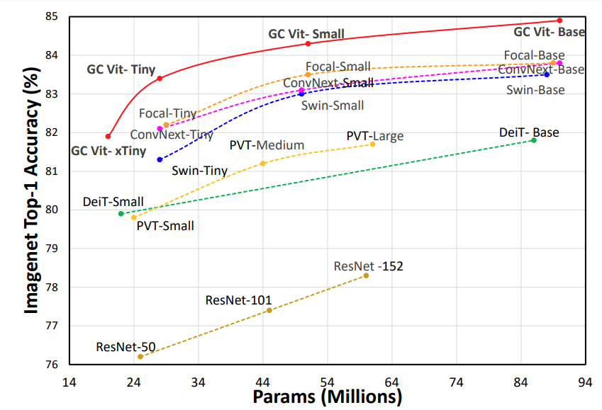
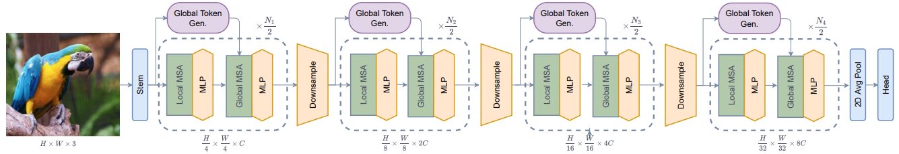
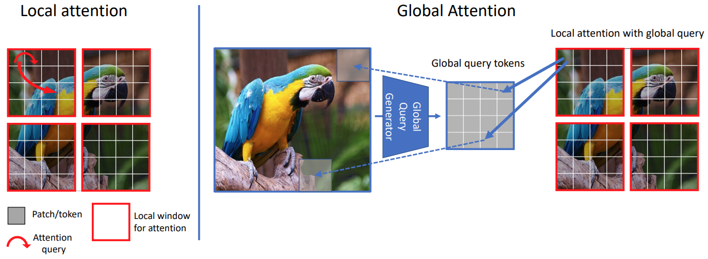

# Global Context Vision Transformer (GC ViT)

This repository is the PyTorch implementation of **Global Context Vision Transformers**. 

GC ViT  achieves state-of-the-art results across image classification, object detection and semantic segmentation tasks. On ImageNet-1K dataset for classification, the tiny, small and base variants of GC ViT with `28M`, `51M` and `90M` parameters achieve `83.3`, `83.9` and `84.4` Top-1 accuracy, respectively, surpassing comparably-sized prior art such as CNN-based ConvNeXt and ViT-based Swin Transformer by a large margin. Pre-trained GC ViT backbones in downstream tasks of object detection, instance segmentation, 
and semantic segmentation using MS COCO and ADE20K datasets outperform prior work consistently, sometimes by large margins.



The architecture of GC ViT is demonstrated in the following:




## Introduction

**GC ViT** leverages global context self-attention modules, joint with local self-attention, to effectively yet efficiently model both long and short-range spatial interactions, without the need for expensive 
operations such as computing attention masks or shifting local windows.



## Results on ImageNet-1K

**ImageNet-1K Pretrained Models**

<table>
  <tr>
    <th>Name</th>
    <th>Acc@1</th>
    <th>#Params</th>
    <th>FLOPs</th>
  </tr>
<tr>
    <td>GC ViT-XT</td>
    <td>82.0</td>
    <td>20</td>
    <td>2.6</td>
</tr>
<tr>
    <td>GC ViT-T</td>
    <td>83.4</td>
    <td>28</td>
    <td>4.7</td>
</tr>
<tr>
    <td>GC ViT-T2</td>
    <td>83.7</td>
    <td>34</td>
    <td>5.5</td>
</tr>
<tr>
    <td>GC ViT-S</td>
    <td>84.3</td>
    <td>51</td>
    <td>8.5</td>
</tr>
<tr>
    <td>GC ViT-S2</td>
    <td>84.7</td>
    <td>68</td>
    <td>10.7</td>
</tr>
<tr>
    <td>GC ViT-B</td>
    <td>84.9</td>
    <td>90</td>
    <td>14.8</td>
</tr>

<tr>
    <td>GC ViT-L</td>
    <td>85.6</td>
    <td>201</td>
    <td>32.6</td>
</tr>

</table>

## Installation

The dependencies can be installed by running:

```bash
pip install -r requirements.txt
```

## Data Preparation

Please download the ImageNet dataset from its official website. The training and validation images need to have
sub-folders for each class with the following structure:

```bash
  imagenet
  ├── train
  │   ├── class1
  │   │   ├── img1.jpeg
  │   │   ├── img2.jpeg
  │   │   └── ...
  │   ├── class2
  │   │   ├── img3.jpeg
  │   │   └── ...
  │   └── ...
  └── val
      ├── class1
      │   ├── img4.jpeg
      │   ├── img5.jpeg
      │   └── ...
      ├── class2
      │   ├── img6.jpeg
      │   └── ...
      └── ...
 
  ```

## Commands

### Training on ImageNet-1K From Scratch (Multi-GPU)

The `GC ViT` model can be trained from scratch on ImageNet-1K dataset by running:

```bash
python -m torch.distributed.launch --nproc_per_node <num-of-gpus> --master_port 11223  train.py \ 
--config <config-file> --data_dir <imagenet-path> --batch-size <batch-size-per-gpu> --tag <run-tag> --model-ema
```

To resume training from a pre-trained checkpoint:

```bash
python -m torch.distributed.launch --nproc_per_node <num-of-gpus> --master_port 11223  train.py \ 
--resume <checkpoint-path> --config <config-file> --data_dir <imagenet-path> --batch-size <batch-size-per-gpu> --tag <run-tag> --model-ema
```

### Evaluation

To evaluate a pre-trained checkpoint using ImageNet-1K validation set on a single GPU:

```bash
python validate.py --model <model-name> --checkpoint <checkpoint-path> --data_dir <imagenet-path> --batch-size <batch-size-per-gpu>
```
